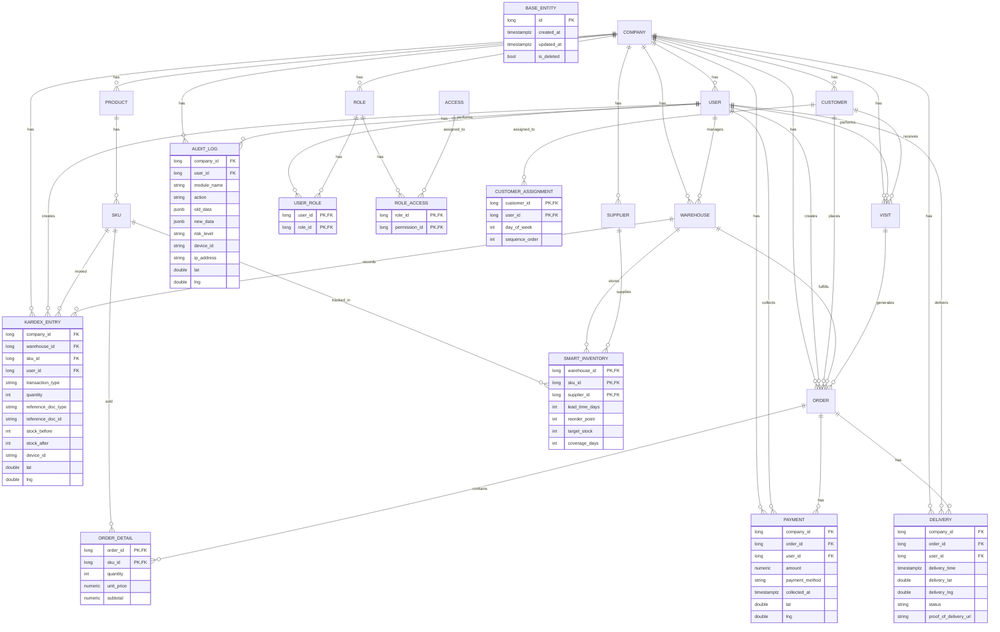

# Entity Framework Core con PostgreSQL - Configuración

## Resumen

Este documento describe la configuración de Entity Framework Core con PostgreSQL implementada en el proyecto, siguiendo
el enfoque **Migration-First (Schema-First)**.

## Arquitectura

### Paquetes NuGet

| Paquete                                                             | Versión | Propósito                         |
|---------------------------------------------------------------------|---------|-----------------------------------|
| `Microsoft.EntityFrameworkCore`                                     | 10.0.3  | Core de EF Core                   |
| `Npgsql.EntityFrameworkCore.PostgreSQL`                             | 10.0.0  | Provider PostgreSQL               |
| `Microsoft.EntityFrameworkCore.Design`                              | 10.0.3  | Herramientas CLI para migraciones |
| `Microsoft.Extensions.Diagnostics.HealthChecks.EntityFrameworkCore` | 10.0.3  | Health checks de base de datos    |

### Proyectos

- **Nexos.Domain**: Entidades de dominio
- **Nexos.Persistence**: DbContext, configuraciones, migraciones
- **Nexos.Services.WebApi**: Registro del DbContext

## Entidades de Dominio

### Diagrama ERD



### Grupo 1: Seguridad (RBAC)

| Entidad      | Tabla             | PK     | Descripción                   |
|--------------|-------------------|--------|-------------------------------|
| `Company`    | Companies         | BIGINT | Empresa/Tenant                |
| `User`       | Users             | BIGINT | Usuarios con autenticación    |
| `Role`       | Roles             | BIGINT | Roles por empresa             |
| `Access`     | SystemPermissions | BIGINT | Permisos globales del sistema |
| `UserRole`   | UserRoles         | BIGINT | Asignación usuario-rol        |
| `RoleAccess` | RoleAccess        | BIGINT | Asignación rol-permiso        |

### Grupo 2: Clientes y Geolocalización

| Entidad              | Tabla               | PK     | Descripción                 |
|----------------------|---------------------|--------|-----------------------------|
| `Customer`           | Customers           | BIGINT | Clientes con ubicación      |
| `CustomerAssignment` | CustomerAssignments | BIGINT | Asignación vendedor-cliente |

### Grupo 3: Productos e Inventario

| Entidad          | Tabla            | PK     | Descripción                    |
|------------------|------------------|--------|--------------------------------|
| `Product`        | Products         | BIGINT | Producto conceptual            |
| `Sku`            | Skus             | BIGINT | Unidad de inventario (barcode) |
| `Warehouse`      | Warehouses       | BIGINT | Bodegas (MAIN, VAN, TRUCK)     |
| `SmartInventory` | SmartInventories | BIGINT | Reglas de reposición (ROP)     |
| `Supplier`       | Suppliers        | BIGINT | Proveedores                    |

### Grupo 4: Transacciones (Kardex)

| Entidad       | Tabla         | PK     | Descripción                                        |
|---------------|---------------|--------|----------------------------------------------------|
| `KardexEntry` | KardexEntries | BIGINT | Movimientos de inventario (IN, OUT, ADJ, TRANSFER) |

### Grupo 5: Ventas

| Entidad       | Tabla        | PK     | Descripción        |
|---------------|--------------|--------|--------------------|
| `Visit`       | Visits       | BIGINT | Visitas a clientes |
| `Order`       | Orders       | BIGINT | Pedidos/Ventas     |
| `OrderDetail` | OrderDetails | BIGINT | Detalle de pedidos |
| `Payment`     | Payments     | BIGINT | Cobros             |
| `Delivery`    | Deliveries   | BIGINT | Entregas           |

### Grupo 6: Auditoría

| Entidad    | Tabla     | PK     | Descripción              |
|------------|-----------|--------|--------------------------|
| `AuditLog` | AuditLogs | BIGINT | Log de auditoría (JSONB) |

## Configuraciones de Entidades

Las configuraciones siguen las mejores prácticas de PostgreSQL:

- **Primary Keys**: `BIGINT GENERATED ALWAYS AS IDENTITY`
- **Strings**: `TEXT` con `CHECK` constraints para valores limitados
- **Fechas**: `TIMESTAMPTZ` (con timezone)
- **Monedas**: `NUMERIC(18,2)`
- **Índices**: Creados automáticamente en columnas FK y filtros comunes
- **Soft Delete**: Query filter global en `BaseEntity`

### Ejemplo de Configuración

```csharp
public class CompanyConfiguration : BaseEntityConfiguration<Company>
{
    public override void Configure(EntityTypeBuilder<Company> builder)
    {
        base.Configure(builder);

        builder.ToTable("Companies");

        builder.Property(c => c.Name)
            .IsRequired()
            .HasMaxLength(200);

        builder.Property(c => c.TaxId)
            .IsRequired()
            .HasMaxLength(50);

        builder.HasIndex(c => c.TaxId).IsUnique();
    }
}
```

## DbContext

```csharp
public class NexosDbContext(DbContextOptions<NexosDbContext> options) : DbContext(options)
{
    public DbSet<Company> Companies => Set<Company>();
    public DbSet<User> Users => Set<User>();
    // ... más DbSets

    protected override void OnModelCreating(ModelBuilder modelBuilder)
    {
        base.OnModelCreating(modelBuilder);
        modelBuilder.ApplyConfigurationsFromAssembly(typeof(NexosDbContext).Assembly);
    }
}
```

## Configuración en Program.cs

```csharp
// Connection string desde configuración
var connectionString = builder.Configuration.GetConnectionString("DefaultConnection")
    ?? throw new InvalidOperationException("Connection string 'DefaultConnection' not found.");

// Registro del DbContext
builder.Services.AddDbContext<NexosDbContext>(options =>
{
    options.UseNpgsql(connectionString);

    if (builder.Environment.IsDevelopment())
    {
        options.EnableSensitiveDataLogging();
        options.EnableDetailedErrors();
    }
});

// Health check de base de datos
builder.Services.AddHealthChecks()
    .AddDbContextCheck<NexosDbContext>("database");
```

## Migraciones

### Crear una nueva migración

```bash
dotnet dotnet-ef migrations add NombreMigracion \
    --project Nexos.Persistence \
    --startup-project Nexos.Services.WebApi \
    --output-dir Migrations
```

### Aplicar migraciones

```bash
# Aplicar directamente (desarrollo)
dotnet dotnet-ef database update \
    --project Nexos.Persistence \
    --startup-project Nexos.Services.WebApi

# Generar script SQL
dotnet dotnet-ef migrations script \
    --project Nexos.Persistence \
    --startup-project Nexos.Services.WebApi \
    -o migration.sql
```

### Revertir migración

```bash
dotnet dotnet-ef database update MigrationsAnterior \
    --project Nexos.Persistence \
    --startup-project Nexos.Services.WebApi
```

## Patrón Repository

El proyecto sigue el patrón Repository con:

- **Interfaz**: En `Nexos.Application.Interface`
- **Implementación**: En `Nexos.Infrastructure` usando EF Core

## Convenciones de Nombrado

### Entidades

- Singular: `Company`, `User`, `Product`
- No usar palabras reservadas: `Access` en lugar de `Permission`

### Tablas

- Plural: `Companies`, `Users`, `Products`
- Snake_case: `customer_assignments`, `smart_inventories`

### Índices

- FK: `IX_Tabla_Columna` (automático)
- Únicos: `AK_Tabla_Columna` (manual)

## Desarrollo

### Regenerar DbContext desde base de datos

```bash
dotnet dotnet-ef dbcontext scaffold \
    "Host=localhost;Database=nexos;Username=nexos_user;Password=nexos_pass" \
    Npgsql.EntityFrameworkCore.PostgreSQL \
    --project Nexos.Persistence \
    --output-dir Entities \
    --context-dir .
```

### Regenerar migraciones (si hay cambios manuales en BD)

```bash
dotnet dotnet-ef migrations remove \
    --project Nexos.Persistence \
    --startup-project Nexos.Services.WebApi

dotnet dotnet-ef migrations add InitialCreate \
    --project Nexos.Persistence \
    --startup-project Nexos.Services.WebApi
```

## Recursos

- [EF Core Documentation](https://docs.microsoft.com/en-us/ef/core/)
- [Npgsql Documentation](https://www.npgsql.org/efcore/)
- [PostgreSQL Table Design](../.agents/skills/postgresql-table-design/SKILL.md)
- [dotnet-backend-patterns](../.agents/skills/dotnet-backend-patterns/SKILL.md)
